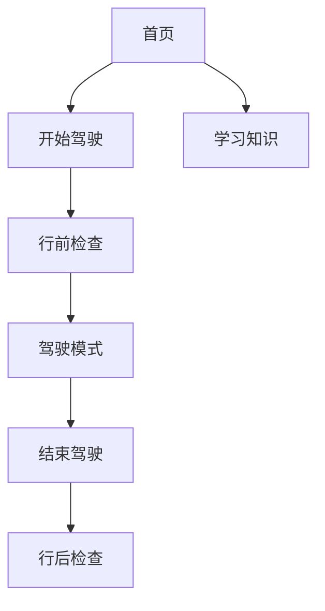

# 无需 Figma 的设计流程

> 目标：不用学习 Figma，也能高效完成设计与交接；所见即所得，一台浏览器即可。

## 1. 一键查看现有设计
- 打开：`design/index.html`（双击即可用浏览器打开）
- 包含：设计系统、线框图、交互原型、用户体验

## 2. 如何修改设计
- 文案与布局：直接编辑以下文件中的文案/模块
  - `design/index.html`
  - `design/design-system.html`
  - `design/wireframes.html`
  - `design/prototypes.html`
  - `design/user-flow.html`
- 主题色/字体/间距：
  - 设计规范参考：`design/design-system/colors.md`、`typography.md`、`spacing.md`
  - 若需页面即时生效：在对应 `.html` 文件 `<style>` 内搜索品牌色 `#22C55E`/`#16A34A` 等并替换；字体与间距同理
- 图标与图片：
  - 优先使用系统 SF Symbols（iOS 实现方便）
  - 自定义图标/图片放入：`design/assets/`，SVG/PDF 优先，位图用 PNG/WebP
  - 在 HTML 中通过 `` 引用

## 3. 画流程/草图（无需安装）
- Excalidraw（推荐）：`https://excalidraw.com`（免费、免登录）
- draw.io：`https://app.diagrams.net/`
- 导出：SVG（推荐）或 PNG；命名：`模块_页面_版本_日期.svg`
- 存放：`design/assets/`；在 `docs/*.md` 或 `design/*.html` 中引用

## 4. 用 Mermaid 直接在 Markdown 里画图
示例（复制到任意 `.md` 文件中即可）：

## 5. 命名与版本
- 资源：`模块_页面_语义_版本_日期.ext`（例：`log_form_v1_2025-01-10.svg`）
- HTML 标记版本注释：`<!-- v1.1 2025-01-10 文案更新 -->`

## 6. 交接与实现
- 交接内容：页面链接 + 改动点清单 + 资源清单
- 开发映射：
  - 颜色/字体/间距 → SwiftUI `Color/Font/Spacing` 常量
  - 组件 → SwiftUI 组件库（Button/Card/Input/Tag/Progress 等）

## 7. 提交流程
- 每次修改附上说明：修改文件、改动点和截图
- 建议 Commit 信息：`chore(design): 调整首页文案与主色`、`docs: 新增流程图` 等

## 8. 更新记录
- 2025-01-xx：创建“无 Figma 设计流程”指南
