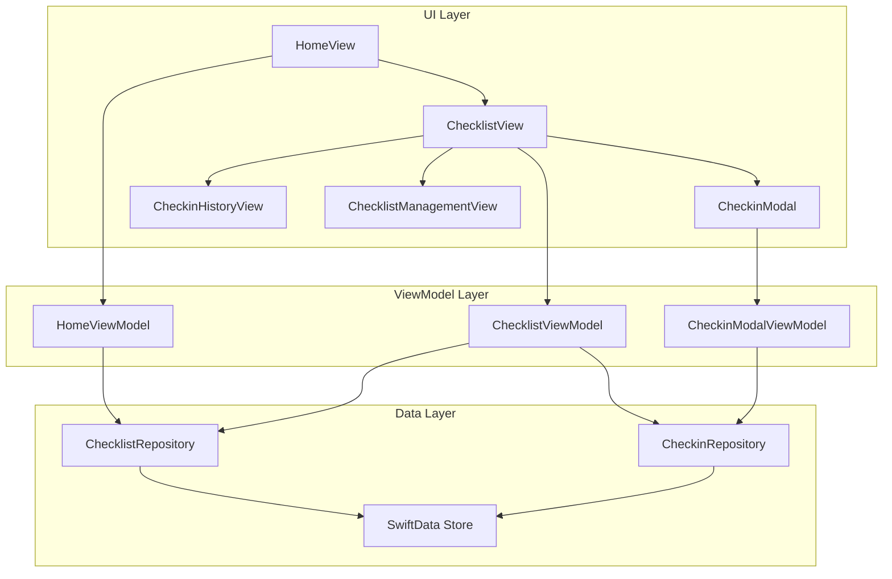
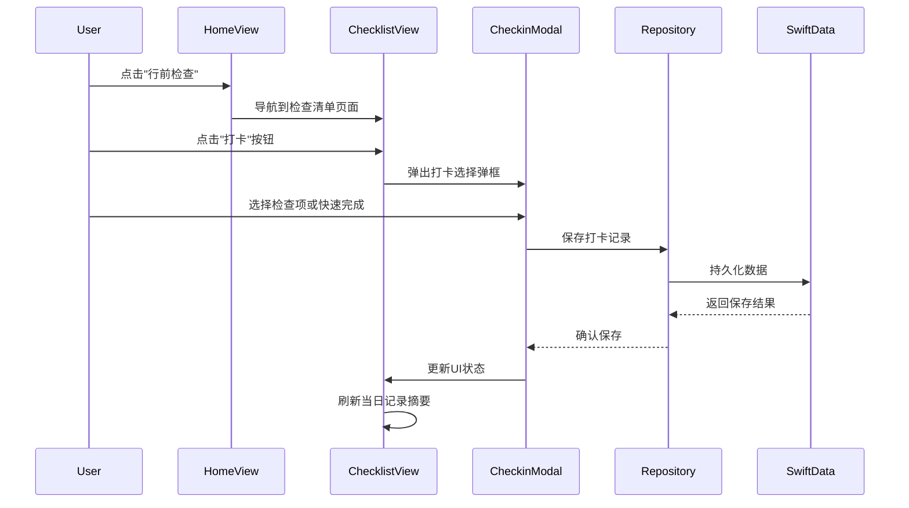
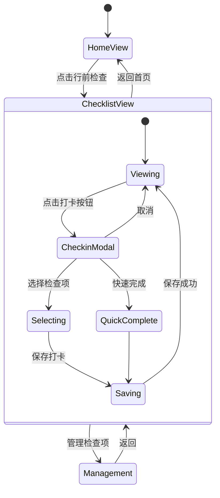
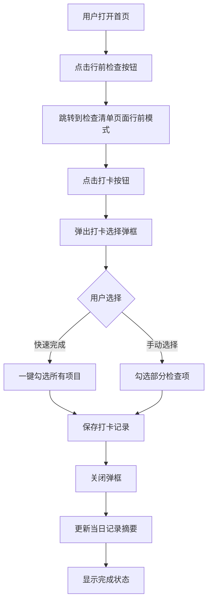

# 首页行前检查跳转与检查清单页面重新设计

## 概述

本设计文档描述了对Safe Driver Note iOS应用中首页"行前检查"功能跳转逻辑的修改，以及检查清单页面打卡功能的全新设计。重点是简化用户操作流程，提供更直观的打卡体验，并增强当日打卡记录的可视化展示。

## 技术栈与依赖

- **框架**: SwiftUI (iOS 17+)
- **数据持久化**: SwiftData
- **架构模式**: MVVM (Model-View-ViewModel)
- **设计模式**: Repository模式
- **核心依赖**: Foundation, SwiftData, Combine

## 需求概述

### 功能需求
1. **首页修改**: 修改首页"行前检查"按钮的跳转逻辑，直接跳转到检查清单页面
2. **检查清单页面重新设计**: 
   - 保留页面头部的行前检查/行后检查模式切换
   - 新增"打卡"按钮作为主要操作入口
   - 实现弹框式检查项选择，支持"快速完成全部检查"
   - 显示当天打卡记录摘要
   - 保留检查项管理功能

### 非功能需求
- 保持现有数据模型兼容性
- 确保操作流畅性（UI响应时间 < 100ms）
- 支持iOS 17+设备
- 遵循苹果Human Interface Guidelines

## 架构设计

### 组件架构图



### 数据流架构



## 功能设计

### 1. 首页行前检查跳转修改

#### 现有实现
```
快速操作区 -> 行前检查按钮 -> [原跳转逻辑]
```

#### 新设计实现
```
快速操作区 -> 行前检查按钮 -> 检查清单页面(行前模式)
```

#### 导航参数设计
```swift
struct ChecklistNavigationParameter {
    let mode: ChecklistMode = .pre
    let shouldShowCheckinModal: Bool = false
}
```

#### 管理检查项弹框设计

```
┌─────────────────────────────────┐
│         📝 管理检查项           │ 40px
├─────────────────────────────────┤
│ ┌─────────────────────────────┐ │ 48px
│ │     + 新增检查项            │ │
│ └─────────────────────────────┘ │
├─────────────────────────────────┤
│ ⋮ 胎压检查           🗑️ ✏️     │ 56px
│ ⋮ 灯光检查           🗑️ ✏️     │ 56px
│ ⋮ 后视镜调整         🗑️ ✏️     │ 56px
│ ⋮ 雨刷功能           🗑️ ✏️     │ 56px
│ ⋮ 油量/电量          🗑️ ✏️     │ 56px
│ ⋮ 座椅/方向盘        🗑️ ✏️     │ 56px
│ ⋮ 导航/路线          🗑️ ✏️     │ 56px
│ ⋮ 随车工具           🗑️ ✏️     │ 56px
├─────────────────────────────────┤
│ ┌───────────┐ ┌───────────────┐ │ 50px
│ │   取消    │ │   完成        │ │
│ └───────────┘ └───────────────┘ │
└─────────────────────────────────┘
```

#### 新增/编辑检查项弹框设计

```
┌─────────────────────────────────┐
│         ✏️ 编辑检查项           │ 40px
├─────────────────────────────────┤
│ 检查项标题                      │ 24px
│ ┌─────────────────────────────┐ │ 44px
│ │ 胎压检查                    │ │
│ └─────────────────────────────┘ │
├─────────────────────────────────┤
│ 检查项描述                      │ 24px
│ ┌─────────────────────────────┐ │ 88px
│ │ 检查四轮胎压是否正常，       │ │
│ │ 确保符合厂商标准...          │ │
│ │                             │ │
│ └─────────────────────────────┘ │
├─────────────────────────────────┤
│ 适用模式                        │ 24px
│ ○ 行前检查  ● 行后检查         │ 40px
├─────────────────────────────────┤
│ 优先级设置                      │ 24px
│ ○ 高  ● 中  ○ 低              │ 40px
├─────────────────────────────────┤
│ ┌───────────┐ ┌───────────────┐ │ 50px
│ │   取消    │ │   保存        │ │
│ └───────────┘ └───────────────┘ │
└─────────────────────────────────┘
```

#### 页面布局结构

```
┌─────────────────────────────────┐
│ ← 检查清单           📊         │ 56px (导航栏)
├─────────────────────────────────┤
│ ┌─────────────┐ ┌─────────────┐ │ 120px (模式切换)
│ │ 🚗 行前检查  │ │ 🅿️ 行后检查  │ │
│ │ ●●○ 6/8项   │ │ ●●●●● 5/5项 │ │
│ └─────────────┘ └─────────────┘ │
├─────────────────────────────────┤
│ ┌─────────────────────────────┐ │ 60px (打卡按钮)
│ │          📝 打卡            │ │
│ └─────────────────────────────┘ │
├─────────────────────────────────┤
│          今日打卡记录           │ 200px (记录摘要)
│ ┌─────────────────────────────┐ │
│ │ 09:30 ✅ 行前检查 (8/8项)   │ │
│ │ 18:45 ✅ 行后检查 (5/5项)   │ │
│ └─────────────────────────────┘ │
├─────────────────────────────────┤
│          管理检查项             │ (可滚动区域)
│ ┌─────────────────────────────┐ │
│ │ + 新增检查项                │ │ 48px
│ │ ⋮ 胎压检查            🗑️ ✏️  │ │ 56px
│ │ ⋮ 灯光检查            🗑️ ✏️  │ │ 56px
│ │ ⋮ 后视镜调整          🗑️ ✏️  │ │ 56px
│ └─────────────────────────────┘ │
└─────────────────────────────────┘
```

#### 打卡弹框设计

```
┌─────────────────────────────────┐
│             🚗 行前检查          │ 40px
├─────────────────────────────────┤
│ ┌─────────────────────────────┐ │ 60px
│ │      ⚡ 快速完成全部检查      │ │
│ └─────────────────────────────┘ │
├─────────────────────────────────┤
│            或选择检查项          │ 32px
├─────────────────────────────────┤
│ ☑️ 胎压检查                     │ 48px
│ ☑️ 灯光检查                     │ 48px
│ ☑️ 后视镜调整                   │ 48px
│ ☐ 雨刷功能                      │ 48px
│ ☐ 油量/电量                     │ 48px
│ ☐ 座椅/方向盘                   │ 48px
│ ☐ 导航/路线                     │ 48px
│ ☐ 随车工具                      │ 48px
├─────────────────────────────────┤
│ ┌───────────┐ ┌───────────────┐ │ 50px
│ │   取消    │ │   保存打卡     │ │
│ └───────────┘ └───────────────┘ │
└─────────────────────────────────┘
```

## 数据模型设计

### 现有数据模型扩展

#### ChecklistPunch 模型增强
```swift
@Model
class ChecklistPunch {
    @Attribute(.unique) var id: UUID
    var createdAt: Date
    var mode: ChecklistMode
    var checkedItemIds: [UUID]
    var isQuickComplete: Bool // 新增：标记是否为快速完成
    var score: Int // 新增：本次打卡得分
    
    init(id: UUID = UUID(), 
         createdAt: Date = Date(), 
         mode: ChecklistMode, 
         checkedItemIds: [UUID],
         isQuickComplete: Bool = false,
         score: Int = 0) {
        self.id = id
        self.createdAt = createdAt
        self.mode = mode
        self.checkedItemIds = checkedItemIds
        self.isQuickComplete = isQuickComplete
        self.score = score
    }
}
```

#### ChecklistItem 模型增强
```swift
@Model
class ChecklistItem {
    @Attribute(.unique) var id: UUID
    var title: String
    var description: String? // 新增：检查项详细描述
    var mode: ChecklistMode
    var priority: ChecklistPriority // 新增：优先级设置
    var isPinned: Bool?
    var sortOrder: Int?
    var isCustom: Bool // 新增：区分系统默认和用户自定义
    var createdAt: Date
    var updatedAt: Date
    
    init(id: UUID = UUID(),
         title: String,
         description: String? = nil,
         mode: ChecklistMode,
         priority: ChecklistPriority = .medium,
         isPinned: Bool? = nil,
         sortOrder: Int? = nil,
         isCustom: Bool = true,
         createdAt: Date = Date(),
         updatedAt: Date = Date()) {
        self.id = id
        self.title = title
        self.description = description
        self.mode = mode
        self.priority = priority
        self.isPinned = isPinned
        self.sortOrder = sortOrder
        self.isCustom = isCustom
        self.createdAt = createdAt
        self.updatedAt = updatedAt
    }
}

enum ChecklistPriority: String, Codable, CaseIterable {
    case high = "high"
    case medium = "medium"
    case low = "low"
    
    var displayName: String {
        switch self {
        case .high: return "高"
        case .medium: return "中"
        case .low: return "低"
        }
    }
    
    var color: Color {
        switch self {
        case .high: return .red
        case .medium: return .orange
        case .low: return .gray
        }
    }
}
```

#### ChecklistItemOperation 新增模型
```swift
struct ChecklistItemOperation {
    enum OperationType {
        case create
        case update
        case delete
        case reorder
    }
    
    let type: OperationType
    let itemId: UUID?
    let fromIndex: Int?
    let toIndex: Int?
    let item: ChecklistItem?
}
```
```swift
struct DailyCheckinSummary: Codable {
    let date: Date
    let prePunches: [ChecklistPunch]
    let postPunches: [ChecklistPunch]
    
    var totalScore: Int {
        let preScore = prePunches.reduce(0) { $0 + $1.score }
        let postScore = postPunches.reduce(0) { $0 + $1.score }
        return preScore + postScore
    }
    
    var completionStatus: String {
        let hasPreCheck = !prePunches.isEmpty
        let hasPostCheck = !postPunches.isEmpty
        
        switch (hasPreCheck, hasPostCheck) {
        case (true, true):
            return "已完成行前行后检查"
        case (true, false):
            return "仅完成行前检查"
        case (false, true):
            return "仅完成行后检查"
        case (false, false):
            return "未进行检查"
        }
    }
}
```

## UI 组件设计

### 1. CheckinModal 组件

```swift
struct CheckinModal: View {
    @StateObject private var viewModel: CheckinModalViewModel
    @Binding var isPresented: Bool
    let mode: ChecklistMode
    
    var body: some View {
        VStack(spacing: 16) {
            // 标题
            HStack {
                Image(systemName: mode == .pre ? "car" : "parkingsign.circle")
                Text(mode == .pre ? "行前检查" : "行后检查")
                    .font(.headline)
            }
            
            // 快速完成按钮
            QuickCompleteButton(
                action: viewModel.quickCompleteAll
            )
            
            // 分隔线和提示
            DividerWithText("或选择检查项")
            
            // 检查项列表
            ChecklistItemSelection(
                items: viewModel.items,
                selectedIds: $viewModel.selectedItemIds
            )
            
            // 底部按钮
            HStack(spacing: 12) {
                CancelButton(action: { isPresented = false })
                SaveButton(
                    action: viewModel.saveCheckin,
                    isEnabled: !viewModel.selectedItemIds.isEmpty
                )
            }
        }
        .padding()
        .background(Color(.systemBackground))
        .cornerRadius(12)
        .shadow(radius: 10)
    }
}
```

### 2. DailyCheckinSummary 组件

```swift
struct DailyCheckinSummaryView: View {
    let summary: DailyCheckinSummary
    
    var body: some View {
        VStack(alignment: .leading, spacing: 12) {
            HStack {
                Text("今日打卡记录")
                    .font(.headline)
                Spacer()
                Text("总分: \(summary.totalScore)")
                    .font(.subheadline)
                    .foregroundColor(.secondary)
            }
            
            LazyVStack(spacing: 8) {
                ForEach(summary.prePunches, id: \.id) { punch in
                    CheckinRecordRow(punch: punch)
                }
                
                ForEach(summary.postPunches, id: \.id) { punch in
                    CheckinRecordRow(punch: punch)
                }
            }
            
            if summary.prePunches.isEmpty && summary.postPunches.isEmpty {
                Text("今日还未进行打卡")
                    .foregroundColor(.secondary)
                    .italic()
            }
        }
        .padding()
        .background(Color(.systemGray6))
        .cornerRadius(8)
    }
}
```

### 4. ChecklistManagementModal 组件

```swift
struct ChecklistManagementModal: View {
    @StateObject private var viewModel: ChecklistManagementViewModel
    @Binding var isPresented: Bool
    let mode: ChecklistMode
    
    var body: some View {
        NavigationView {
            VStack(spacing: 16) {
                // 标题
                HStack {
                    Image(systemName: "doc.text")
                    Text("管理检查项")
                        .font(.headline)
                }
                
                // 新增按钮
                AddNewItemButton {
                    viewModel.showAddItemSheet = true
                }
                
                // 检查项列表（支持拖拽排序）
                List {
                    ForEach(viewModel.items, id: \.id) { item in
                        ChecklistItemManagementRow(
                            item: item,
                            onEdit: { viewModel.editItem(item) },
                            onDelete: { viewModel.deleteItem(item) }
                        )
                    }
                    .onMove(perform: viewModel.moveItems)
                    .onDelete(perform: viewModel.deleteItems)
                }
                .environment(\.editMode, $viewModel.editMode)
                
                // 底部按钮
                HStack(spacing: 12) {
                    CancelButton { isPresented = false }
                    CompleteButton {
                        viewModel.saveChanges()
                        isPresented = false
                    }
                }
            }
            .padding()
            .navigationBarHidden(true)
        }
        .sheet(isPresented: $viewModel.showAddItemSheet) {
            ChecklistItemEditModal(
                item: nil,
                mode: mode,
                onSave: viewModel.addItem
            )
        }
        .sheet(isPresented: $viewModel.showEditItemSheet) {
            if let editingItem = viewModel.editingItem {
                ChecklistItemEditModal(
                    item: editingItem,
                    mode: mode,
                    onSave: viewModel.updateItem
                )
            }
        }
    }
}
```

### 5. ChecklistItemEditModal 组件

```swift
struct ChecklistItemEditModal: View {
    @StateObject private var viewModel: ChecklistItemEditViewModel
    @Environment(\.dismiss) private var dismiss
    
    let item: ChecklistItem?
    let mode: ChecklistMode
    let onSave: (ChecklistItem) -> Void
    
    init(item: ChecklistItem?, mode: ChecklistMode, onSave: @escaping (ChecklistItem) -> Void) {
        self.item = item
        self.mode = mode
        self.onSave = onSave
        self._viewModel = StateObject(wrappedValue: ChecklistItemEditViewModel(item: item, mode: mode))
    }
    
    var body: some View {
        NavigationView {
            VStack(spacing: 24) {
                // 标题
                HStack {
                    Image(systemName: "pencil")
                    Text(item == nil ? "新增检查项" : "编辑检查项")
                        .font(.headline)
                }
                
                VStack(alignment: .leading, spacing: 16) {
                    // 标题输入
                    VStack(alignment: .leading, spacing: 8) {
                        Text("检查项标题")
                            .font(.subheadline)
                            .foregroundColor(.secondary)
                        TextField("输入检查项标题", text: $viewModel.title)
                            .textFieldStyle(RoundedBorderTextFieldStyle())
                    }
                    
                    // 描述输入
                    VStack(alignment: .leading, spacing: 8) {
                        Text("检查项描述")
                            .font(.subheadline)
                            .foregroundColor(.secondary)
                        TextField("输入详细描述（可选）", text: $viewModel.description, axis: .vertical)
                            .textFieldStyle(RoundedBorderTextFieldStyle())
                            .lineLimit(3...6)
                    }
                    
                    // 适用模式
                    VStack(alignment: .leading, spacing: 8) {
                        Text("适用模式")
                            .font(.subheadline)
                            .foregroundColor(.secondary)
                        HStack(spacing: 20) {
                            RadioButton(
                                title: "行前检查",
                                isSelected: viewModel.selectedMode == .pre
                            ) {
                                viewModel.selectedMode = .pre
                            }
                            
                            RadioButton(
                                title: "行后检查",
                                isSelected: viewModel.selectedMode == .post
                            ) {
                                viewModel.selectedMode = .post
                            }
                        }
                    }
                    
                    // 优先级设置
                    VStack(alignment: .leading, spacing: 8) {
                        Text("优先级设置")
                            .font(.subheadline)
                            .foregroundColor(.secondary)
                        HStack(spacing: 20) {
                            ForEach(ChecklistPriority.allCases, id: \.self) { priority in
                                RadioButton(
                                    title: priority.displayName,
                                    isSelected: viewModel.selectedPriority == priority,
                                    color: priority.color
                                ) {
                                    viewModel.selectedPriority = priority
                                }
                            }
                        }
                    }
                }
                
                Spacer()
                
                // 底部按钮
                HStack(spacing: 12) {
                    CancelButton { dismiss() }
                    SaveButton(
                        action: {
                            let savedItem = viewModel.createItem()
                            onSave(savedItem)
                            dismiss()
                        },
                        isEnabled: viewModel.isValid
                    )
                }
            }
            .padding()
            .navigationBarHidden(true)
        }
    }
}
```

### 6. ChecklistItemManagementRow 组件

```swift
struct ChecklistItemManagementRow: View {
    let item: ChecklistItem
    let onEdit: () -> Void
    let onDelete: () -> Void
    
    var body: some View {
        HStack {
            // 拖拽手柄
            Image(systemName: "line.horizontal.3")
                .foregroundColor(.gray)
                .font(.title2)
            
            VStack(alignment: .leading, spacing: 4) {
                HStack {
                    Text(item.title)
                        .font(.body)
                        .fontWeight(.medium)
                    
                    Spacer()
                    
                    // 优先级标记
                    PriorityBadge(priority: item.priority)
                }
                
                if let description = item.description, !description.isEmpty {
                    Text(description)
                        .font(.caption)
                        .foregroundColor(.secondary)
                        .lineLimit(2)
                }
            }
            
            Spacer()
            
            // 操作按钮
            HStack(spacing: 8) {
                Button(action: onDelete) {
                    Image(systemName: "trash")
                        .foregroundColor(.red)
                        .font(.title3)
                }
                
                Button(action: onEdit) {
                    Image(systemName: "pencil")
                        .foregroundColor(.blue)
                        .font(.title3)
                }
            }
        }
        .padding(.vertical, 8)
        .background(Color(.systemBackground))
    }
}
```

### 7. 辅助组件

```swift
// 新增按钮
struct AddNewItemButton: View {
    let action: () -> Void
    
    var body: some View {
        Button(action: action) {
            HStack {
                Image(systemName: "plus.circle.fill")
                Text("新增检查项")
                    .font(.system(.body, design: .rounded, weight: .medium))
            }
            .frame(maxWidth: .infinity)
            .frame(height: 44)
            .background(Color(.systemBlue).opacity(0.1))
            .foregroundColor(.blue)
            .cornerRadius(8)
            .overlay(
                RoundedRectangle(cornerRadius: 8)
                    .stroke(Color.blue.opacity(0.3), lineWidth: 1)
            )
        }
    }
}

// 单选按钮
struct RadioButton: View {
    let title: String
    let isSelected: Bool
    let color: Color
    let action: () -> Void
    
    init(title: String, isSelected: Bool, color: Color = .blue, action: @escaping () -> Void) {
        self.title = title
        self.isSelected = isSelected
        self.color = color
        self.action = action
    }
    
    var body: some View {
        Button(action: action) {
            HStack(spacing: 8) {
                Image(systemName: isSelected ? "largecircle.fill.circle" : "circle")
                    .foregroundColor(isSelected ? color : .gray)
                Text(title)
                    .foregroundColor(isSelected ? color : .primary)
            }
        }
    }
}

// 优先级徽章
struct PriorityBadge: View {
    let priority: ChecklistPriority
    
    var body: some View {
        Text(priority.displayName)
            .font(.caption2)
            .fontWeight(.medium)
            .padding(.horizontal, 8)
            .padding(.vertical, 2)
            .background(priority.color.opacity(0.2))
            .foregroundColor(priority.color)
            .cornerRadius(12)
    }
}
```

```swift
struct QuickCompleteButton: View {
    let action: () -> Void
    
    var body: some View {
        Button(action: action) {
            HStack {
                Image(systemName: "bolt.fill")
                Text("快速完成全部检查")
                    .font(.system(.body, design: .rounded, weight: .medium))
            }
            .frame(maxWidth: .infinity)
            .frame(height: 50)
            .background(
                LinearGradient(
                    colors: [.blue, .cyan],
                    startPoint: .leading,
                    endPoint: .trailing
                )
            )
            .foregroundColor(.white)
            .cornerRadius(8)
        }
    }
}
```

## ViewModel 设计

### ChecklistManagementViewModel

```swift
@MainActor
class ChecklistManagementViewModel: ObservableObject {
    @Published var items: [ChecklistItem] = []
    @Published var editMode: EditMode = .inactive
    @Published var showAddItemSheet = false
    @Published var showEditItemSheet = false
    @Published var editingItem: ChecklistItem?
    @Published var isLoading = false
    
    private let repository: ChecklistRepositoryProtocol
    private let mode: ChecklistMode
    private var originalItems: [ChecklistItem] = []
    
    init(mode: ChecklistMode, repository: ChecklistRepositoryProtocol) {
        self.mode = mode
        self.repository = repository
        loadItems()
    }
    
    func loadItems() {
        Task {
            isLoading = true
            items = await repository.getItems(for: mode)
            originalItems = items
            isLoading = false
        }
    }
    
    func addItem(_ item: ChecklistItem) {
        items.append(item)
        updateSortOrder()
    }
    
    func editItem(_ item: ChecklistItem) {
        editingItem = item
        showEditItemSheet = true
    }
    
    func updateItem(_ updatedItem: ChecklistItem) {
        if let index = items.firstIndex(where: { $0.id == updatedItem.id }) {
            items[index] = updatedItem
        }
        editingItem = nil
    }
    
    func deleteItem(_ item: ChecklistItem) {
        items.removeAll { $0.id == item.id }
    }
    
    func deleteItems(at indexSet: IndexSet) {
        items.remove(atOffsets: indexSet)
    }
    
    func moveItems(from source: IndexSet, to destination: Int) {
        items.move(fromOffsets: source, toOffset: destination)
        updateSortOrder()
    }
    
    func saveChanges() {
        Task {
            isLoading = true
            
            // 保存所有更改
            for item in items {
                await repository.save(item)
            }
            
            // 删除不在列表中的项目
            let deletedItems = originalItems.filter { originalItem in
                !items.contains { $0.id == originalItem.id }
            }
            
            for item in deletedItems {
                await repository.delete(item)
            }
            
            isLoading = false
            
            // 发送通知更新UI
            NotificationCenter.default.post(
                name: .checklistItemsChanged,
                object: nil
            )
        }
    }
    
    private func updateSortOrder() {
        for (index, item) in items.enumerated() {
            item.sortOrder = index
            item.updatedAt = Date()
        }
    }
}
```

### ChecklistItemEditViewModel

```swift
@MainActor
class ChecklistItemEditViewModel: ObservableObject {
    @Published var title: String = ""
    @Published var description: String = ""
    @Published var selectedMode: ChecklistMode = .pre
    @Published var selectedPriority: ChecklistPriority = .medium
    
    private let originalItem: ChecklistItem?
    private let defaultMode: ChecklistMode
    
    var isValid: Bool {
        !title.trimmingCharacters(in: .whitespacesAndNewlines).isEmpty
    }
    
    init(item: ChecklistItem?, mode: ChecklistMode) {
        self.originalItem = item
        self.defaultMode = mode
        
        if let item = item {
            // 编辑模式
            self.title = item.title
            self.description = item.description ?? ""
            self.selectedMode = item.mode
            self.selectedPriority = item.priority
        } else {
            // 新增模式
            self.selectedMode = mode
        }
    }
    
    func createItem() -> ChecklistItem {
        let trimmedTitle = title.trimmingCharacters(in: .whitespacesAndNewlines)
        let trimmedDescription = description.trimmingCharacters(in: .whitespacesAndNewlines)
        
        if let existingItem = originalItem {
            // 更新现有项目
            existingItem.title = trimmedTitle
            existingItem.description = trimmedDescription.isEmpty ? nil : trimmedDescription
            existingItem.mode = selectedMode
            existingItem.priority = selectedPriority
            existingItem.updatedAt = Date()
            return existingItem
        } else {
            // 创建新项目
            return ChecklistItem(
                title: trimmedTitle,
                description: trimmedDescription.isEmpty ? nil : trimmedDescription,
                mode: selectedMode,
                priority: selectedPriority,
                isCustom: true
            )
        }
    }
}
```

```swift
@MainActor
class CheckinModalViewModel: ObservableObject {
    @Published var items: [ChecklistItem] = []
    @Published var selectedItemIds: Set<UUID> = []
    @Published var isLoading = false
    
    private let repository: ChecklistRepositoryProtocol
    private let checkinRepository: CheckinRepositoryProtocol
    private let mode: ChecklistMode
    
    init(mode: ChecklistMode, 
         repository: ChecklistRepositoryProtocol,
         checkinRepository: CheckinRepositoryProtocol) {
        self.mode = mode
        self.repository = repository
        self.checkinRepository = checkinRepository
        loadItems()
    }
    
    func loadItems() {
        Task {
            items = await repository.getItems(for: mode)
        }
    }
    
    func quickCompleteAll() {
        Task {
            isLoading = true
            let allItemIds = items.map { $0.id }
            await saveCheckin(itemIds: allItemIds, isQuickComplete: true)
            isLoading = false
        }
    }
    
    func saveCheckin() {
        Task {
            isLoading = true
            await saveCheckin(itemIds: Array(selectedItemIds), isQuickComplete: false)
            isLoading = false
        }
    }
    
    private func saveCheckin(itemIds: [UUID], isQuickComplete: Bool) async {
        let score = calculateScore(checkedIds: itemIds)
        let punch = ChecklistPunch(
            mode: mode,
            checkedItemIds: itemIds,
            isQuickComplete: isQuickComplete,
            score: score
        )
        
        await checkinRepository.save(punch)
        
        // 发送通知更新UI
        NotificationCenter.default.post(
            name: .checkinCompleted,
            object: punch
        )
    }
    
    private func calculateScore(checkedIds: [UUID]) -> Int {
        let totalItems = items.count
        let checkedItems = checkedIds.count
        return totalItems > 0 ? (checkedItems * 100) / totalItems : 0
    }
}
```

## 状态管理

### 应用状态流



### 数据状态同步

```swift
extension Notification.Name {
    static let checkinCompleted = Notification.Name("checkinCompleted")
    static let checklistItemsChanged = Notification.Name("checklistItemsChanged")
}

extension ChecklistViewModel {
    func setupNotifications() {
        NotificationCenter.default.addObserver(
            forName: .checkinCompleted,
            object: nil,
            queue: .main
        ) { [weak self] notification in
            guard let punch = notification.object as? ChecklistPunch else { return }
            self?.handleCheckinCompleted(punch)
        }
    }
    
    private func handleCheckinCompleted(_ punch: ChecklistPunch) {
        // 更新当日记录摘要
        refreshDailySummary()
        
        // 更新进度显示
        updateProgress()
        
        // 触发UI刷新
        objectWillChange.send()
    }
}
```

## 交互设计

### 管理检查项操作流程图

```mermaid
flowchart TD
    A[用户点击管理检查项] --> B[弹出管理模态框]
    B --> C{用户操作选择}
    
    C -->|+ 新增| D[点击新增检查项]
    D --> E[弹出编辑模态框]
    E --> F[输入标题和描述]
    F --> G[选择模式和优先级]
    G --> H[点击保存]
    H --> I[添加到列表]
    
    C -->|✏️ 编辑| J[点击编辑按钮]
    J --> K[弹出编辑模态框]
    K --> L[修改项目信息]
    L --> M[点击保存]
    M --> N[更新列表项]
    
    C -->|🗑️ 删除| O[点击删除按钮]
    O --> P[确认删除操作]
    P --> Q[从列表移除]
    
    C -->|⋮ 拖拽| R[长按项目]
    R --> S[开始拖拽模式]
    S --> T[拖拽到目标位置]
    T --> U[释放手指]
    U --> V[更新排序]
    
    I --> W[点击完成]
    N --> W
    Q --> W
    V --> W
    W --> X[保存所有更改]
    X --> Y[关闭管理模态框]
    Y --> Z[更新主页面]
end
```



### 手势交互

| 操作 | 手势 | 响应 |
|------|------|------|
| 打开打卡弹框 | 点击打卡按钮 | 从底部滑入弹框动画 |
| 选择检查项 | 点击检查项 | 勾选状态切换，带触觉反馈 |
| 快速完成 | 点击快速完成按钮 | 全选动画效果 |
| 关闭弹框 | 点击取消或外部区域 | 向下滑出动画 |
| 模式切换 | 点击行前/行后卡片 | 淡入淡出切换效果 |
| 打开管理模态框 | 点击管理检查项 | 弹框从底部滑入 |
| 新增检查项 | 点击+新增按钮 | 打开编辑模态框 |
| 编辑检查项 | 点击✏️编辑按钮 | 打开编辑模态框带预填数据 |
| 删除检查项 | 点击🗑️删除按钮 | 滑动消失动画 |
| 拖拽排序 | 长按⋮图标拖拽 | 项目跨座拖拽动画 |
| 保存编辑 | 点击保存按钮 | 触觉反馈+模态框关闭 |
| 取消编辑 | 点击取消或返回 | 模态框关闭无保存 |

## 测试策略

### 单元测试

```swift
class CheckinModalViewModelTests: XCTestCase {
    var viewModel: CheckinModalViewModel!
    var mockRepository: MockChecklistRepository!
    var mockCheckinRepository: MockCheckinRepository!
    
    override func setUp() {
        super.setUp()
        mockRepository = MockChecklistRepository()
        mockCheckinRepository = MockCheckinRepository()
        viewModel = CheckinModalViewModel(
            mode: .pre,
            repository: mockRepository,
            checkinRepository: mockCheckinRepository
        )
    }
    
    func testQuickCompleteAll() async {
        // Given
        let items = [
            ChecklistItem(title: "胎压检查", mode: .pre),
            ChecklistItem(title: "灯光检查", mode: .pre)
        ]
        mockRepository.items = items
        
        // When
        await viewModel.quickCompleteAll()
        
        // Then
        XCTAssertEqual(mockCheckinRepository.savedPunches.count, 1)
        XCTAssertTrue(mockCheckinRepository.savedPunches.first?.isQuickComplete ?? false)
        XCTAssertEqual(mockCheckinRepository.savedPunches.first?.score, 100)
    }
    
    func testPartialSelection() async {
        // Given
        let items = [
            ChecklistItem(title: "胎压检查", mode: .pre),
            ChecklistItem(title: "灯光检查", mode: .pre)
        ]
        mockRepository.items = items
        viewModel.selectedItemIds = Set([items[0].id])
        
        // When
        await viewModel.saveCheckin()
        
        // Then
        XCTAssertEqual(mockCheckinRepository.savedPunches.count, 1)
        XCTAssertFalse(mockCheckinRepository.savedPunches.first?.isQuickComplete ?? true)
        XCTAssertEqual(mockCheckinRepository.savedPunches.first?.score, 50)
    }
}

class ChecklistManagementViewModelTests: XCTestCase {
    var viewModel: ChecklistManagementViewModel!
    var mockRepository: MockChecklistRepository!
    
    override func setUp() {
        super.setUp()
        mockRepository = MockChecklistRepository()
        viewModel = ChecklistManagementViewModel(
            mode: .pre,
            repository: mockRepository
        )
    }
    
    func testAddNewItem() {
        // Given
        let newItem = ChecklistItem(title: "新检查项", mode: .pre)
        
        // When
        viewModel.addItem(newItem)
        
        // Then
        XCTAssertTrue(viewModel.items.contains { $0.id == newItem.id })
        XCTAssertEqual(viewModel.items.last?.sortOrder, viewModel.items.count - 1)
    }
    
    func testDeleteItem() {
        // Given
        let item = ChecklistItem(title: "测试项", mode: .pre)
        viewModel.items = [item]
        
        // When
        viewModel.deleteItem(item)
        
        // Then
        XCTAssertFalse(viewModel.items.contains { $0.id == item.id })
    }
    
    func testMoveItems() {
        // Given
        let items = [
            ChecklistItem(title: "项目1", mode: .pre),
            ChecklistItem(title: "项目2", mode: .pre),
            ChecklistItem(title: "项目3", mode: .pre)
        ]
        viewModel.items = items
        
        // When
        viewModel.moveItems(from: IndexSet([0]), to: 2)
        
        // Then
        XCTAssertEqual(viewModel.items[0].title, "项目2")
        XCTAssertEqual(viewModel.items[1].title, "项目1")
        XCTAssertEqual(viewModel.items[2].title, "项目3")
        
        // 验证排序更新
        for (index, item) in viewModel.items.enumerated() {
            XCTAssertEqual(item.sortOrder, index)
        }
    }
    
    func testSaveChanges() async {
        // Given
        let originalItems = [
            ChecklistItem(title: "原始项目", mode: .pre)
        ]
        let newItem = ChecklistItem(title: "新项目", mode: .pre)
        
        viewModel.originalItems = originalItems
        viewModel.items = [newItem] // 删除了原始项目，添加了新项目
        
        // When
        await viewModel.saveChanges()
        
        // Then
        XCTAssertEqual(mockRepository.savedItems.count, 1)
        XCTAssertEqual(mockRepository.savedItems.first?.title, "新项目")
        XCTAssertEqual(mockRepository.deletedItems.count, 1)
        XCTAssertEqual(mockRepository.deletedItems.first?.title, "原始项目")
    }
}

class ChecklistItemEditViewModelTests: XCTestCase {
    func testCreateNewItem() {
        // Given
        let viewModel = ChecklistItemEditViewModel(item: nil, mode: .pre)
        viewModel.title = "测试标题"
        viewModel.description = "测试描述"
        viewModel.selectedPriority = .high
        
        // When
        let item = viewModel.createItem()
        
        // Then
        XCTAssertEqual(item.title, "测试标题")
        XCTAssertEqual(item.description, "测试描述")
        XCTAssertEqual(item.mode, .pre)
        XCTAssertEqual(item.priority, .high)
        XCTAssertTrue(item.isCustom)
    }
    
    func testEditExistingItem() {
        // Given
        let existingItem = ChecklistItem(title: "原标题", mode: .pre)
        let viewModel = ChecklistItemEditViewModel(item: existingItem, mode: .pre)
        viewModel.title = "新标题"
        
        // When
        let updatedItem = viewModel.createItem()
        
        // Then
        XCTAssertEqual(updatedItem.id, existingItem.id)
        XCTAssertEqual(updatedItem.title, "新标题")
    }
    
    func testValidation() {
        // Given
        let viewModel = ChecklistItemEditViewModel(item: nil, mode: .pre)
        
        // When & Then
        XCTAssertFalse(viewModel.isValid) // 空标题
        
        viewModel.title = "   "
        XCTAssertFalse(viewModel.isValid) // 空白字符
        
        viewModel.title = "有效标题"
        XCTAssertTrue(viewModel.isValid) // 有效标题
    }
}
```

### UI 测试

```swift
class ChecklistUITests: XCTestCase {
    var app: XCUIApplication!
    
    override func setUp() {
        super.setUp()
        app = XCUIApplication()
        app.launch()
    }
    
    func testCheckinFlow() {
        // 从首页跳转到检查清单
        app.buttons["行前检查"].tap()
        
        // 验证页面跳转
        XCTAssertTrue(app.navigationBars["检查清单"].exists)
        
        // 点击打卡按钮
        app.buttons["打卡"].tap()
        
        // 验证弹框出现
        XCTAssertTrue(app.staticTexts["行前检查"].exists)
        XCTAssertTrue(app.buttons["快速完成全部检查"].exists)
        
        // 测试快速完成
        app.buttons["快速完成全部检查"].tap()
        
        // 验证弹框关闭和记录更新
        XCTAssertFalse(app.buttons["快速完成全部检查"].exists)
        XCTAssertTrue(app.staticTexts["今日打卡记录"].exists)
    }
    
    func testChecklistManagement() {
        // 从首页跳转到检查清单
        app.buttons["行前检查"].tap()
        
        // 点击管理检查项
        app.staticTexts["管理检查项"].tap()
        
        // 验证管理弹框出现
        XCTAssertTrue(app.staticTexts["📝 管理检查项"].exists)
        XCTAssertTrue(app.buttons["新增检查项"].exists)
        
        // 测试新增功能
        app.buttons["新增检查项"].tap()
        
        // 验证编辑弹框出现
        XCTAssertTrue(app.staticTexts["新增检查项"].exists)
        XCTAssertTrue(app.textFields["输入检查项标题"].exists)
        
        // 输入数据
        app.textFields["输入检查项标题"].tap()
        app.textFields["输入检查项标题"].typeText("测试检查项")
        
        // 保存
        app.buttons["保存"].tap()
        
        // 验证新项目出现在列表中
        XCTAssertTrue(app.staticTexts["测试检查项"].exists)
    }
    
    func testItemReordering() {
        // 进入管理模式
        app.buttons["行前检查"].tap()
        app.staticTexts["管理检查项"].tap()
        
        // 获取第一个项目
        let firstItem = app.staticTexts["胎压检查"]
        let secondItem = app.staticTexts["灯光检查"]
        
        XCTAssertTrue(firstItem.exists)
        XCTAssertTrue(secondItem.exists)
        
        // 模拟拖拽操作（简化测试）
        let firstItemCoordinate = firstItem.coordinate(withNormalizedOffset: CGVector(dx: 0.5, dy: 0.5))
        let secondItemCoordinate = secondItem.coordinate(withNormalizedOffset: CGVector(dx: 0.5, dy: 0.5))
        
        firstItemCoordinate.press(forDuration: 1.0, thenDragTo: secondItemCoordinate)
        
        // 验证顺序变化（具体实现可能需要根据实际UI调整）
        app.buttons["完成"].tap()
    }
    
    func testItemDeletion() {
        // 进入管理模式
        app.buttons["行前检查"].tap()
        app.staticTexts["管理检查项"].tap()
        
        // 点击删除按钮
        app.buttons["🗑️"].firstMatch.tap()
        
        // 验证项目被删除（具体实现可能需要根据实际UI调整）
        app.buttons["完成"].tap()
        XCTAssertFalse(app.staticTexts["已删除项目"].exists)
    }
}
```

## 开发实施计划

### 迭代开发阶段

#### 第一阶段：基础功能实现

**1. 数据模型扩展**

首先需要扩展现有的 `ChecklistItem` 和 `ChecklistPunch` 模型：

```swift
// 在 Models.swift 中修改 ChecklistItem
@Model final class ChecklistItem {
    @Attribute(.unique) var id: UUID
    var title: String
    var description: String? // 新增：检查项详细描述
    var mode: ChecklistMode
    var priority: ChecklistPriority // 新增：优先级设置
    var isPinned: Bool?
    var sortOrder: Int?
    var isCustom: Bool // 新增：区分系统默认和用户自定义
    var createdAt: Date
    var updatedAt: Date
    
    // 更新初始化方法
}

// 新增优先级枚举
enum ChecklistPriority: String, Codable, CaseIterable {
    case high = "high"
    case medium = "medium"
    case low = "low"
}

// 扩展 ChecklistPunch
@Model final class ChecklistPunch {
    @Attribute(.unique) var id: UUID
    var createdAt: Date
    var mode: ChecklistMode
    var checkedItemIds: [UUID]
    var isQuickComplete: Bool // 新增：标记是否为快速完成
    var score: Int // 新增：本次打卡得分
    
    // 更新初始化方法
}
```

**2. 修改首页导航逻辑**

在 `HomeView.swift` 中修改行前检查按钮：

```swift
// 修改前
NavigationLink(destination: ChecklistView()) {
    ActionCard(title: "行前检查", icon: "checkmark.seal", color: .brandInfo500) {}
}

// 修改后
NavigationLink(destination: ChecklistView(initialMode: .pre)) {
    ActionCard(title: "行前检查", icon: "checkmark.seal", color: .brandInfo500) {}
}
```

**3. 重构 ChecklistView**

修改 `ChecklistView.swift` 支持初始模式参数：

```swift
struct ChecklistView: View {
    @StateObject private var vm: ChecklistViewModel
    @State private var showingCheckinModal = false
    @State private var showingManagementModal = false
    
    init(initialMode: ChecklistMode = .pre) {
        self._vm = StateObject(wrappedValue: ChecklistViewModel(
            repository: AppDI.shared.checklistRepository,
            initialMode: initialMode
        ))
    }
    
    // 实现新的UI布局
}
```

#### 第二阶段：打卡功能实现

**1. 创建打卡弹框组件**

创建新文件 `CheckinModal.swift`：

```swift
struct CheckinModal: View {
    @StateObject private var viewModel: CheckinModalViewModel
    @Binding var isPresented: Bool
    let mode: ChecklistMode
    
    // 实现弹框UI和交互逻辑
}
```

**2. 创建当日记录摘要组件**

创建新文件 `DailyCheckinSummaryView.swift`：

```swift
struct DailyCheckinSummaryView: View {
    let summary: DailyCheckinSummary
    
    // 实现记录摘要显示
}
```

#### 第三阶段：管理功能实现

**1. 创建管理检查项组件**

创建新文件 `ChecklistManagementModal.swift`：

```swift
struct ChecklistManagementModal: View {
    @StateObject private var viewModel: ChecklistManagementViewModel
    @Binding var isPresented: Bool
    let mode: ChecklistMode
    
    // 实现管理界面
}
```

**2. 创建编辑检查项组件**

创建新文件 `ChecklistItemEditModal.swift`：

```swift
struct ChecklistItemEditModal: View {
    @StateObject private var viewModel: ChecklistItemEditViewModel
    let item: ChecklistItem?
    let mode: ChecklistMode
    let onSave: (ChecklistItem) -> Void
    
    // 实现编辑界面
}
```

#### 第四阶段：ViewModel 实现

**1. 扩展 ChecklistViewModel**

```swift
@MainActor
class ChecklistViewModel: ObservableObject {
    @Published var mode: ChecklistMode
    @Published var items: [ChecklistItem] = []
    @Published var dailySummary: DailyCheckinSummary?
    @Published var showingCheckinModal = false
    @Published var showingManagementModal = false
    
    // 实现新的业务逻辑方法
}
```

**2. 创建新的ViewModel类**

创建 `CheckinModalViewModel.swift`、`ChecklistManagementViewModel.swift` 和 `ChecklistItemEditViewModel.swift`

### 文件结构变更

```
Features/Checklist/
├── ChecklistView.swift (修改)
├── ChecklistViewModel.swift (修改)
├── CheckinModal.swift (新增)
├── CheckinModalViewModel.swift (新增)
├── ChecklistManagementModal.swift (新增)
├── ChecklistManagementViewModel.swift (新增)
├── ChecklistItemEditModal.swift (新增)
├── ChecklistItemEditViewModel.swift (新增)
├── DailyCheckinSummaryView.swift (新增)
└── ChecklistItemManagementRow.swift (新增)
```

### 开发优先级

1. **高优先级**：数据模型扩展、首页导航修改、基础打卡功能
2. **中优先级**：当日记录摘要、管理检查项基础功能
3. **低优先级**：拖拽排序、优先级设置、高级编辑功能

### 测试计划

- **单元测试**：每个ViewModel的业务逻辑
- **集成测试**：数据持久化和状态同步
- **UI测试**：关键用户流程的端到端测试

### 技术风险评估

1. **SwiftData模型变更**：可能需要数据迁移
2. **UI复杂度**：多层弹框的状态管理
3. **性能考虑**：大量检查项的渲染优化
}

class ChecklistManagementViewModelTests: XCTestCase {
    var viewModel: ChecklistManagementViewModel!
    var mockRepository: MockChecklistRepository!
    
    override func setUp() {
        super.setUp()
        mockRepository = MockChecklistRepository()
        viewModel = ChecklistManagementViewModel(
            mode: .pre,
            repository: mockRepository
        )
    }
    
    func testAddNewItem() {
        // Given
        let newItem = ChecklistItem(title: "新检查项", mode: .pre)
        
        // When
        viewModel.addItem(newItem)
        
        // Then
        XCTAssertTrue(viewModel.items.contains { $0.id == newItem.id })
        XCTAssertEqual(viewModel.items.last?.sortOrder, viewModel.items.count - 1)
    }
    
    func testDeleteItem() {
        // Given
        let item = ChecklistItem(title: "测试项", mode: .pre)
        viewModel.items = [item]
        
        // When
        viewModel.deleteItem(item)
        
        // Then
        XCTAssertFalse(viewModel.items.contains { $0.id == item.id })
    }
    
    func testMoveItems() {
        // Given
        let items = [
            ChecklistItem(title: "项目1", mode: .pre),
            ChecklistItem(title: "项目2", mode: .pre),
            ChecklistItem(title: "项目3", mode: .pre)
        ]
        viewModel.items = items
        
        // When
        viewModel.moveItems(from: IndexSet([0]), to: 2)
        
        // Then
        XCTAssertEqual(viewModel.items[0].title, "项目2")
        XCTAssertEqual(viewModel.items[1].title, "项目1")
        XCTAssertEqual(viewModel.items[2].title, "项目3")
        
        // 验证排序更新
        for (index, item) in viewModel.items.enumerated() {
            XCTAssertEqual(item.sortOrder, index)
        }
    }
    
    func testSaveChanges() async {
        // Given
        let originalItems = [
            ChecklistItem(title: "原始项目", mode: .pre)
        ]
        let newItem = ChecklistItem(title: "新项目", mode: .pre)
        
        viewModel.originalItems = originalItems
        viewModel.items = [newItem] // 删除了原始项目，添加了新项目
        
        // When
        await viewModel.saveChanges()
        
        // Then
        XCTAssertEqual(mockRepository.savedItems.count, 1)
        XCTAssertEqual(mockRepository.savedItems.first?.title, "新项目")
        XCTAssertEqual(mockRepository.deletedItems.count, 1)
        XCTAssertEqual(mockRepository.deletedItems.first?.title, "原始项目")
    }
}

class ChecklistItemEditViewModelTests: XCTestCase {
    func testCreateNewItem() {
        // Given
        let viewModel = ChecklistItemEditViewModel(item: nil, mode: .pre)
        viewModel.title = "测试标题"
        viewModel.description = "测试描述"
        viewModel.selectedPriority = .high
        
        // When
        let item = viewModel.createItem()
        
        // Then
        XCTAssertEqual(item.title, "测试标题")
        XCTAssertEqual(item.description, "测试描述")
        XCTAssertEqual(item.mode, .pre)
        XCTAssertEqual(item.priority, .high)
        XCTAssertTrue(item.isCustom)
    }
    
    func testEditExistingItem() {
        // Given
        let existingItem = ChecklistItem(title: "原标题", mode: .pre)
        let viewModel = ChecklistItemEditViewModel(item: existingItem, mode: .pre)
        viewModel.title = "新标题"
        
        // When
        let updatedItem = viewModel.createItem()
        
        // Then
        XCTAssertEqual(updatedItem.id, existingItem.id)
        XCTAssertEqual(updatedItem.title, "新标题")
    }
    
    func testValidation() {
        // Given
        let viewModel = ChecklistItemEditViewModel(item: nil, mode: .pre)
        
        // When & Then
        XCTAssertFalse(viewModel.isValid) // 空标题
        
        viewModel.title = "   "
        XCTAssertFalse(viewModel.isValid) // 空白字符
        
        viewModel.title = "有效标题"
        XCTAssertTrue(viewModel.isValid) // 有效标题
}
```

### UI 测试

```swift
class ChecklistUITests: XCTestCase {
    var app: XCUIApplication!
    
    override func setUp() {
        super.setUp()
        app = XCUIApplication()
        app.launch()
    }
    
    func testCheckinFlow() {
        // 从首页跳转到检查清单
        app.buttons["行前检查"].tap()
        
        // 验证页面跳转
        XCTAssertTrue(app.navigationBars["检查清单"].exists)
        
        // 点击打卡按钮
        app.buttons["打卡"].tap()
        
        // 验证弹框出现
        XCTAssertTrue(app.staticTexts["行前检查"].exists)
        XCTAssertTrue(app.buttons["快速完成全部检查"].exists)
        
        // 测试快速完成
        app.buttons["快速完成全部检查"].tap()
        
        // 验证弹框关闭和记录更新
        XCTAssertFalse(app.buttons["快速完成全部检查"].exists)
        XCTAssertTrue(app.staticTexts["今日打卡记录"].exists)
    }
    
    func testChecklistManagement() {
        // 从首页跳转到检查清单
        app.buttons["行前检查"].tap()
        
        // 点击管理检查项
        app.staticTexts["管理检查项"].tap()
        
        // 验证管理弹框出现
        XCTAssertTrue(app.staticTexts["📝 管理检查项"].exists)
        XCTAssertTrue(app.buttons["新增检查项"].exists)
        
        // 测试新增功能
        app.buttons["新增检查项"].tap()
        
        // 验证编辑弹框出现
        XCTAssertTrue(app.staticTexts["新增检查项"].exists)
        XCTAssertTrue(app.textFields["输入检查项标题"].exists)
        
        // 输入数据
        app.textFields["输入检查项标题"].tap()
        app.textFields["输入检查项标题"].typeText("测试检查项")
        
        // 保存
        app.buttons["保存"].tap()
        
        // 验证新项目出现在列表中
        XCTAssertTrue(app.staticTexts["测试检查项"].exists)
    }
    
    func testItemReordering() {
        // 进入管理模式
        app.buttons["行前检查"].tap()
        app.staticTexts["管理检查项"].tap()
        
        // 获取第一个项目
        let firstItem = app.staticTexts["胎压检查"]
        let secondItem = app.staticTexts["灯光检查"]
        
        XCTAssertTrue(firstItem.exists)
        XCTAssertTrue(secondItem.exists)
        
        // 模拟拖拽操作（简化测试）
        let firstItemCoordinate = firstItem.coordinate(withNormalizedOffset: CGVector(dx: 0.5, dy: 0.5))
        let secondItemCoordinate = secondItem.coordinate(withNormalizedOffset: CGVector(dx: 0.5, dy: 0.5))
        
        firstItemCoordinate.press(forDuration: 1.0, thenDragTo: secondItemCoordinate)
        
        // 验证顺序变化（具体实现可能需要根据实际UI调整）
        app.buttons["完成"].tap()
    }
    
    func testItemDeletion() {
        // 进入管理模式
        app.buttons["行前检查"].tap()
        app.staticTexts["管理检查项"].tap()
        
        // 点击删除按钮
        app.buttons["🗑️"].firstMatch.tap()
        
        // 验证项目被删除（具体实现可能需要根据实际UI调整）
        app.buttons["完成"].tap()
        XCTAssertFalse(app.staticTexts["已删除项目"].exists)
    }
}
```