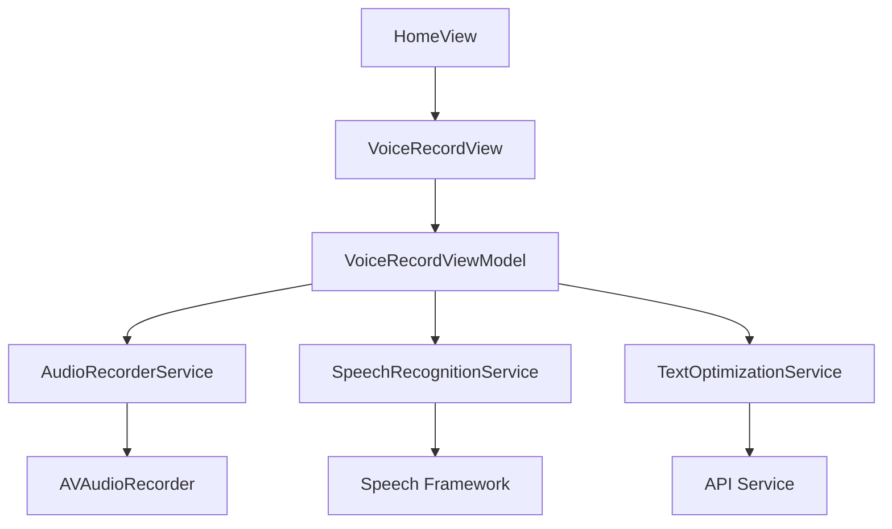
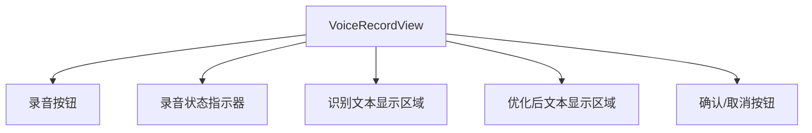
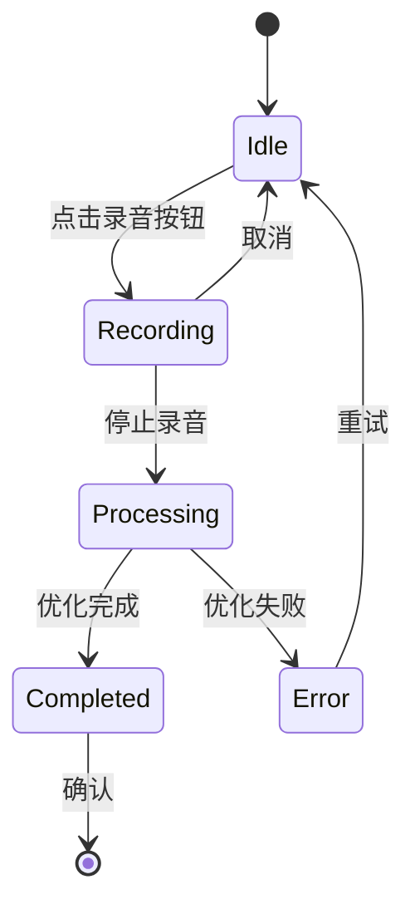
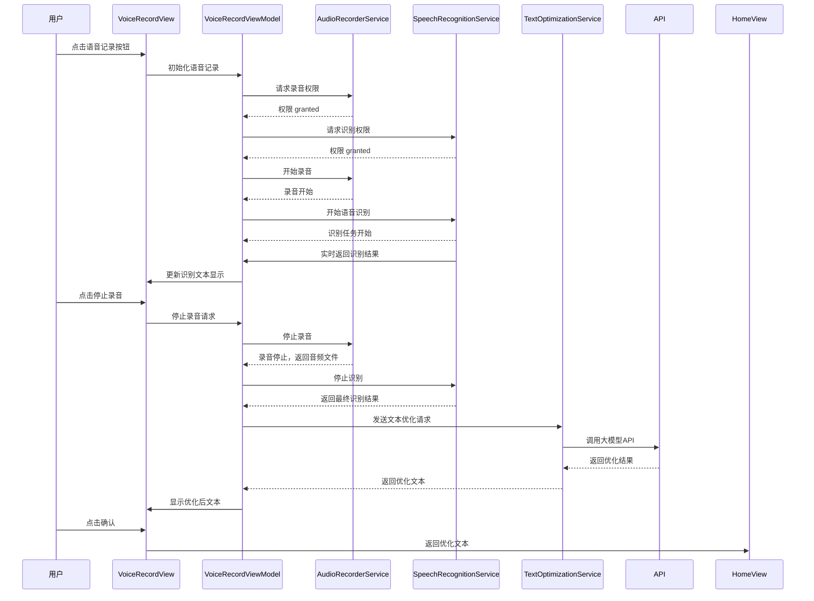
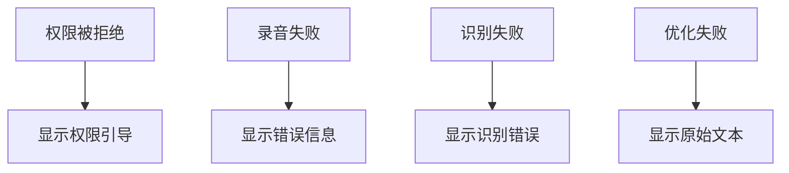

# 语音记录功能开发设计文档

## 1. 概述

### 1.1 功能目标
开发首页语音记录功能，允许用户通过语音输入记录驾驶日志内容，并实时将语音转换为文字，再通过大模型进行文本优化和纠正。

### 1.2 核心需求
- 点击首页"语音记录"按钮启动语音录入功能
- 实时录音并显示录音状态
- 实时将语音转换为文字并显示
- 调用大模型对识别结果进行优化和纠正
- 将最终文本内容填充到驾驶日志表单中

### 1.3 技术选型
- 使用AVAudioRecorder进行音频录制
- 使用Speech框架进行语音识别
- 使用免费的API（如通义千问）进行文本优化

## 2. 架构设计

### 2.1 整体架构


### 2.2 模块划分
1. **UI层 (VoiceRecordView)**
   - 录音界面展示
   - 录音状态显示
   - 识别文本实时显示
   - 最终文本展示和确认

2. **ViewModel层 (VoiceRecordViewModel)**
   - 协调各服务组件
   - 管理录音状态
   - 处理识别文本更新
   - 调用文本优化服务

3. **服务层**
   - AudioRecorderService: 音频录制服务
   - SpeechRecognitionService: 语音识别服务
   - TextOptimizationService: 文本优化服务

## 3. 详细设计

### 3.1 数据模型

#### 3.1.1 语音识别结果模型
```swift
struct SpeechRecognitionResult {
    let text: String
    let isFinal: Bool
    let confidence: Float
}
```

#### 3.1.2 录音状态模型
```swift
enum RecordingState {
    case idle
    case recording
    case processing
    case completed
    case error(String)
}
```

### 3.2 核心组件

#### 3.2.1 AudioRecorderService (音频录制服务)
负责使用AVAudioRecorder进行音频录制：
- 请求麦克风权限
- 开始/停止录音
- 管理音频文件存储
- 提供录音状态回调

#### 3.2.2 SpeechRecognitionService (语音识别服务)
负责使用Speech框架进行实时语音识别：
- 请求语音识别权限
- 开始/停止语音识别
- 实时返回识别结果
- 处理识别错误

#### 3.2.3 TextOptimizationService (文本优化服务)
负责调用大模型API对识别文本进行优化：
- 构造API请求
- 发送识别文本到API
- 接收并解析优化结果
- 提供错误处理机制

### 3.3 UI设计

#### 3.3.1 语音记录视图 (VoiceRecordView)


主要组件：
1. **录音按钮**:
   - 点击开始录音
   - 再次点击停止录音
   - 显示录音状态(录音中/停止)

2. **录音状态指示器**:
   - 显示当前录音状态
   - 显示录音时长
   - 显示音量级别

3. **识别文本显示区域**:
   - 实时显示语音识别结果
   - 区分临时结果和最终结果

4. **优化后文本显示区域**:
   - 显示大模型优化后的文本
   - 支持编辑

5. **操作按钮**:
   - 确认: 将文本填充到日志表单
   - 取消: 放弃本次录音

#### 3.3.2 状态流转


### 3.4 交互流程

#### 3.4.1 主要流程


#### 3.4.2 错误处理流程


## 4. API设计

### 4.1 服务接口

#### 4.1.1 AudioRecorderService 接口
```swift
protocol AudioRecorderServiceProtocol {
    func requestPermission() async throws -> Bool
    func startRecording() async throws
    func stopRecording() async throws -> URL
    var isRecording: Bool { get }
    var audioLevel: Float { get }
}
```

#### 4.1.2 SpeechRecognitionService 接口
```swift
protocol SpeechRecognitionServiceProtocol {
    func requestPermission() async throws -> Bool
    func startRecognition() async throws
    func stopRecognition() async throws
    var isRecognizing: Bool { get }
    var onResult: ((SpeechRecognitionResult) -> Void)? { get set }
    var onError: ((Error) -> Void)? { get set }
}
```

#### 4.1.3 TextOptimizationService 接口
```swift
protocol TextOptimizationServiceProtocol {
    func optimizeText(_ text: String) async throws -> String
}
```

### 4.2 数据仓库接口
```swift
protocol VoiceRecordRepository {
    func saveAudioFile(_ url: URL) throws -> String
    func loadAudioFile(named fileName: String) throws -> URL
}
```

## 5. 业务逻辑层

### 5.1 VoiceRecordViewModel 实现

#### 5.1.1 状态管理
```swift
@MainActor
final class VoiceRecordViewModel: ObservableObject {
    @Published private(set) var recordingState: RecordingState = .idle
    @Published private(set) var recognizedText: String = ""
    @Published private(set) var optimizedText: String = ""
    @Published private(set) var recordingTime: TimeInterval = 0
    @Published private(set) var audioLevel: Float = 0
    
    private var timer: Timer?
    private var audioRecorder: AudioRecorderServiceProtocol
    private var speechRecognizer: SpeechRecognitionServiceProtocol
    private var textOptimizer: TextOptimizationServiceProtocol
}
```

#### 5.1.2 核心方法
```swift
extension VoiceRecordViewModel {
    func startRecording() async {
        // 实现开始录音逻辑
    }
    
    func stopRecording() async {
        // 实现停止录音逻辑
    }
    
    func cancelRecording() {
        // 实现取消录音逻辑
    }
    
    func confirmText() {
        // 实现确认文本逻辑
    }
}
```

### 5.2 权限处理
- 麦克风权限: 通过AVAudioSession请求
- 语音识别权限: 通过Speech框架请求
- 权限拒绝处理: 引导用户到系统设置

### 5.3 错误处理
- 网络错误: 显示重试选项
- API错误: 显示错误信息并提供备选方案
- 权限错误: 显示权限引导
- 录音/识别错误: 显示具体错误信息

## 6. 集成与测试

### 6.1 集成点
1. **与首页集成**:
   - 修改HomeView中的"语音记录"按钮，导航到VoiceRecordView
   - 实现回调机制，将优化后的文本传递回日志表单

2. **与日志模块集成**:
   - 将优化后的文本填充到LogEditorView的相应字段中
   - 保存音频文件并关联到LogEntry

### 6.2 测试策略

#### 6.2.1 单元测试
1. **AudioRecorderService测试**:
   - 权限请求逻辑
   - 录音开始/停止功能
   - 音频文件管理

2. **SpeechRecognitionService测试**:
   - 权限请求逻辑
   - 识别开始/停止功能
   - 结果回调处理

3. **TextOptimizationService测试**:
   - API调用逻辑
   - 结果解析处理
   - 错误处理

4. **VoiceRecordViewModel测试**:
   - 状态管理
   - 业务逻辑处理
   - 各服务协调

#### 6.2.2 UI测试
1. **录音流程测试**:
   - 录音按钮交互
   - 状态显示正确性
   - 文本显示更新

2. **权限处理测试**:
   - 权限拒绝场景
   - 权限引导流程

3. **错误处理测试**:
   - 网络错误场景
   - API错误场景
   - 录音错误场景

## 7. 性能与安全考虑

### 7.1 性能优化
- 音频文件压缩存储
- 识别结果增量更新
- API调用异步处理
- 内存使用优化

### 7.2 安全考虑
- 音频文件本地存储加密
- API调用HTTPS传输
- 权限最小化原则
- 用户数据隐私保护

## 8. 部署与监控

### 8.1 部署方案
- 通过App Store发布
- 支持iOS 17+系统版本

### 8.2 监控指标
- 录音成功率
- 识别准确率
- API响应时间
- 用户使用时长- 调用大模型对识别结果进行优化和纠正
- 将最终文本内容填充到驾驶日志表单中

### 1.3 技术选型
- 使用AVAudioRecorder进行音频录制
- 使用Speech框架进行语音识别
- 使用免费的API（如通义千问）进行文本优化

## 2. 架构设计

### 2.1 整体架构


### 2.2 模块划分
1. **UI层 (VoiceRecordView)**
   - 录音界面展示
   - 录音状态显示
   - 识别文本实时显示
   - 最终文本展示和确认

2. **ViewModel层 (VoiceRecordViewModel)**
   - 协调各服务组件
   - 管理录音状态
   - 处理识别文本更新
   - 调用文本优化服务

3. **服务层**
   - AudioRecorderService: 音频录制服务
   - SpeechRecognitionService: 语音识别服务
   - TextOptimizationService: 文本优化服务

## 3. 详细设计

### 3.1 数据模型

#### 3.1.1 语音识别结果模型
```swift
struct SpeechRecognitionResult {
    let text: String
    let isFinal: Bool
    let confidence: Float
}
```

#### 3.1.2 录音状态模型
```swift
enum RecordingState {
    case idle
    case recording
    case processing
    case completed
    case error(String)
}
```

### 3.2 核心组件

#### 3.2.1 AudioRecorderService (音频录制服务)
负责使用AVAudioRecorder进行音频录制：
- 请求麦克风权限
- 开始/停止录音
- 管理音频文件存储
- 提供录音状态回调

#### 3.2.2 SpeechRecognitionService (语音识别服务)
负责使用Speech框架进行实时语音识别：
- 请求语音识别权限
- 开始/停止语音识别
- 实时返回识别结果
- 处理识别错误

#### 3.2.3 TextOptimizationService (文本优化服务)
负责调用大模型API对识别文本进行优化：
- 构造API请求
- 发送识别文本到API
- 接收并解析优化结果
- 提供错误处理机制

### 3.3 UI设计

#### 3.3.1 语音记录视图 (VoiceRecordView)


主要组件：
1. **录音按钮**:
   - 点击开始录音
   - 再次点击停止录音
   - 显示录音状态(录音中/停止)

2. **录音状态指示器**:
   - 显示当前录音状态
   - 显示录音时长
   - 显示音量级别

3. **识别文本显示区域**:
   - 实时显示语音识别结果
   - 区分临时结果和最终结果

4. **优化后文本显示区域**:
   - 显示大模型优化后的文本
   - 支持编辑

5. **操作按钮**:
   - 确认: 将文本填充到日志表单
   - 取消: 放弃本次录音

#### 3.3.2 状态流转


### 3.4 交互流程

#### 3.4.1 主要流程


#### 3.4.2 错误处理流程


## 4. API设计

### 4.1 服务接口

#### 4.1.1 AudioRecorderService 接口
```swift
protocol AudioRecorderServiceProtocol {
    func requestPermission() async throws -> Bool
    func startRecording() async throws
    func stopRecording() async throws -> URL
    var isRecording: Bool { get }
    var audioLevel: Float { get }
}
```

#### 4.1.2 SpeechRecognitionService 接口
```swift
protocol SpeechRecognitionServiceProtocol {
    func requestPermission() async throws -> Bool
    func startRecognition() async throws
    func stopRecognition() async throws
    var isRecognizing: Bool { get }
    var onResult: ((SpeechRecognitionResult) -> Void)? { get set }
    var onError: ((Error) -> Void)? { get set }
}
```

#### 4.1.3 TextOptimizationService 接口
```swift
protocol TextOptimizationServiceProtocol {
    func optimizeText(_ text: String) async throws -> String
}
```

### 4.2 数据仓库接口
```swift
protocol VoiceRecordRepository {
    func saveAudioFile(_ url: URL) throws -> String
    func loadAudioFile(named fileName: String) throws -> URL
}
```

## 5. 业务逻辑层

### 5.1 VoiceRecordViewModel 实现

#### 5.1.1 状态管理
```swift
@MainActor
final class VoiceRecordViewModel: ObservableObject {
    @Published private(set) var recordingState: RecordingState = .idle
    @Published private(set) var recognizedText: String = ""
    @Published private(set) var optimizedText: String = ""
    @Published private(set) var recordingTime: TimeInterval = 0
    @Published private(set) var audioLevel: Float = 0
    
    private var timer: Timer?
    private var audioRecorder: AudioRecorderServiceProtocol
    private var speechRecognizer: SpeechRecognitionServiceProtocol
    private var textOptimizer: TextOptimizationServiceProtocol
}
```

#### 5.1.2 核心方法
```swift
extension VoiceRecordViewModel {
    func startRecording() async {
        // 实现开始录音逻辑
    }
    
    func stopRecording() async {
        // 实现停止录音逻辑
    }
    
    func cancelRecording() {
        // 实现取消录音逻辑
    }
    
    func confirmText() {
        // 实现确认文本逻辑
    }
}
```

### 5.2 权限处理
- 麦克风权限: 通过AVAudioSession请求
- 语音识别权限: 通过Speech框架请求
- 权限拒绝处理: 引导用户到系统设置

### 5.3 错误处理
- 网络错误: 显示重试选项
- API错误: 显示错误信息并提供备选方案
- 权限错误: 显示权限引导
- 录音/识别错误: 显示具体错误信息

## 6. 集成与测试

### 6.1 集成点
1. **与首页集成**:
   - 修改HomeView中的"语音记录"按钮，导航到VoiceRecordView
   - 实现回调机制，将优化后的文本传递回日志表单

2. **与日志模块集成**:
   - 将优化后的文本填充到LogEditorView的相应字段中
   - 保存音频文件并关联到LogEntry

### 6.2 测试策略

#### 6.2.1 单元测试
1. **AudioRecorderService测试**:
   - 权限请求逻辑
   - 录音开始/停止功能
   - 音频文件管理

2. **SpeechRecognitionService测试**:
   - 权限请求逻辑
   - 识别开始/停止功能
   - 结果回调处理

3. **TextOptimizationService测试**:
   - API调用逻辑
   - 结果解析处理
   - 错误处理

4. **VoiceRecordViewModel测试**:
   - 状态管理
   - 业务逻辑处理
   - 各服务协调

#### 6.2.2 UI测试
1. **录音流程测试**:
   - 录音按钮交互
   - 状态显示正确性
   - 文本显示更新

2. **权限处理测试**:
   - 权限拒绝场景
   - 权限引导流程

3. **错误处理测试**:
   - 网络错误场景
   - API错误场景
   - 录音错误场景

## 7. 性能与安全考虑

### 7.1 性能优化
- 音频文件压缩存储
- 识别结果增量更新
- API调用异步处理
- 内存使用优化

### 7.2 安全考虑
- 音频文件本地存储加密
- API调用HTTPS传输
- 权限最小化原则
- 用户数据隐私保护

## 8. 部署与监控

### 8.1 部署方案
- 通过App Store发布
- 支持iOS 17+系统版本

### 8.2 监控指标
- 录音成功率
- 识别准确率
- API响应时间
- 用户使用时长


